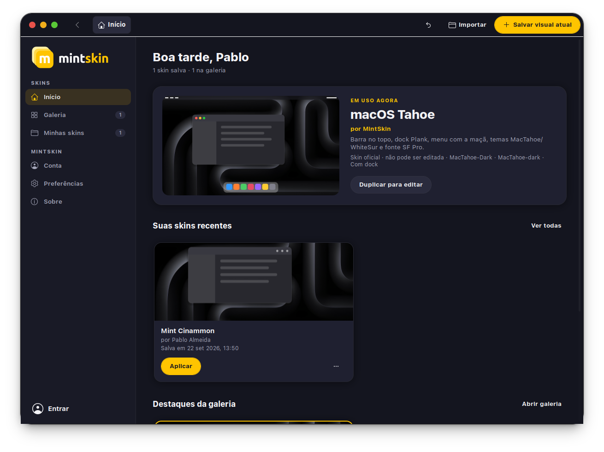
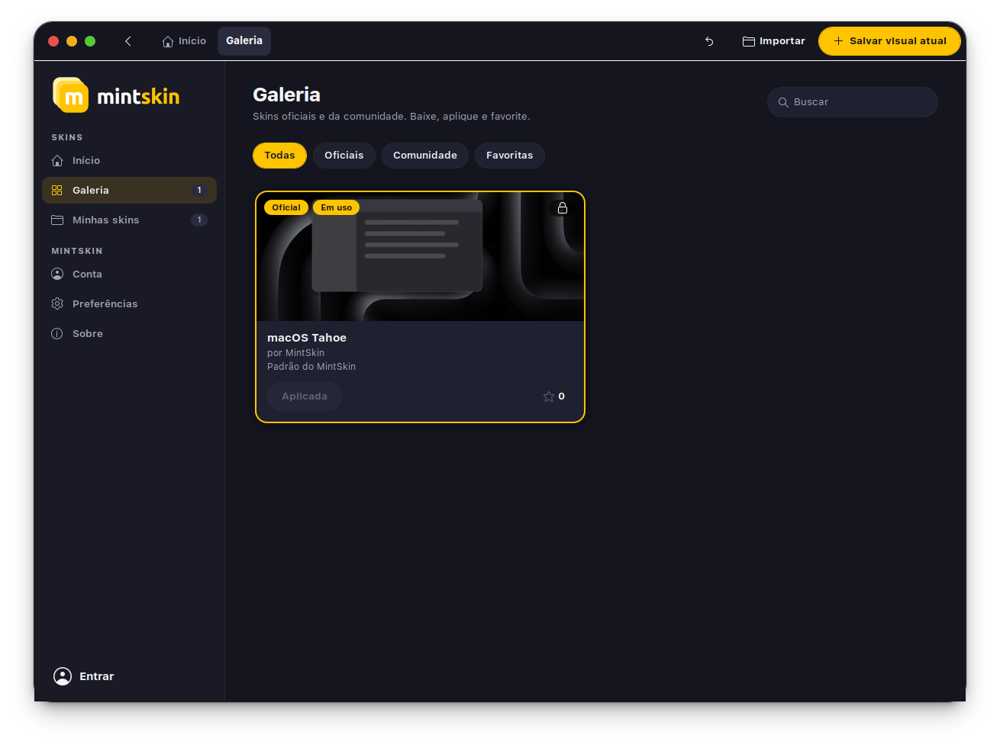
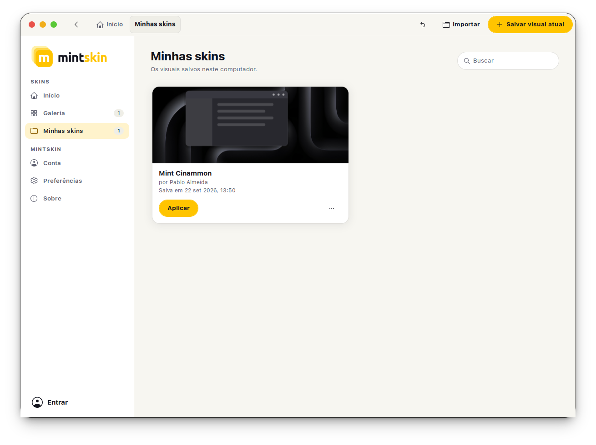
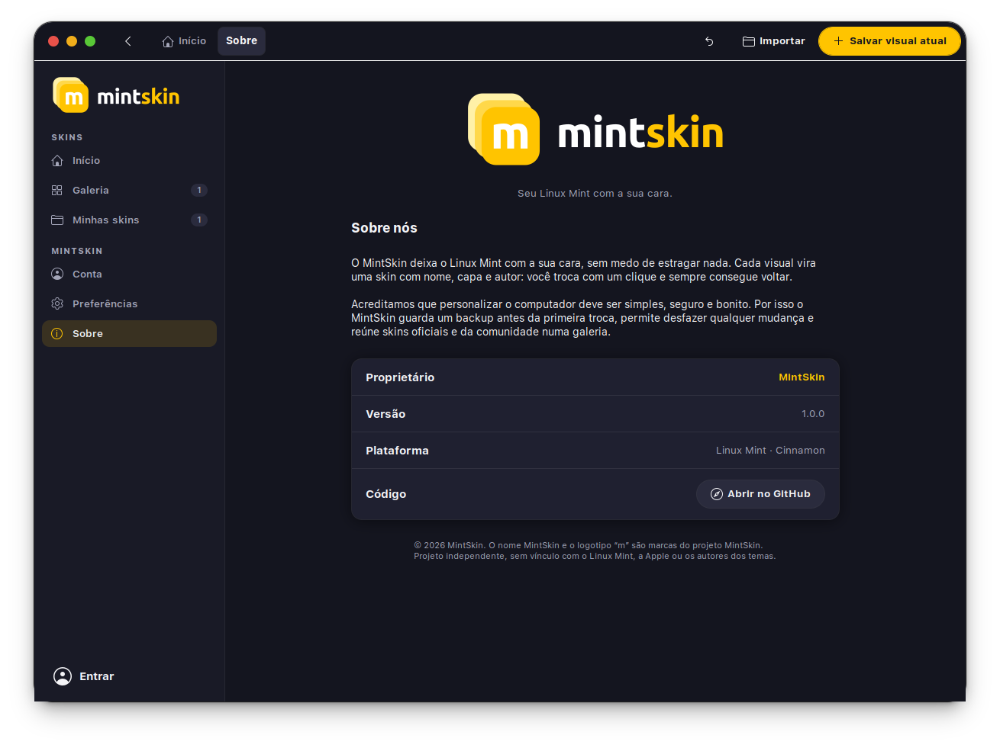

<p align="center">
  <picture>
    <source media="(prefers-color-scheme: dark)" srcset="mintskin/ui/marca/logo-escuro.svg">
    
  </picture>
</p>

<p align="center"><strong>Troque o visual do seu Linux Mint Cinnamon com um clique.</strong></p>

<p align="center">
  <a href="https://github.com/PablUoo/MintSkin/releases"></a>
  
  
  
</p>

O MintSkin guarda o visual do desktop como **skins**, cada uma com nome, capa e
autor. Salve quantas quiser, troque entre elas e sempre volte para a anterior.

## Vitrine

<p align="center">
  
</p>

<table>
  <tr>
    <td align="center" width="50%">
      <br>
      <sub><b>Início</b> · tema claro</sub>
    </td>
    <td align="center" width="50%">
      <br>
      <sub><b>Galeria</b> · oficiais e da comunidade</sub>
    </td>
  </tr>
  <tr>
    <td align="center">
      <br>
      <sub><b>Minhas skins</b> · aplicar, renomear, enviar</sub>
    </td>
    <td align="center">
      <br>
      <sub><b>Sobre</b> · marca e proprietário</sub>
    </td>
  </tr>
</table>

## Recursos

- **Skin oficial macOS Tahoe** incluída: barra no topo, dock e menu com a maçã
- **Galeria** com skins oficiais e da comunidade: veja os detalhes, o perfil do
  autor, baixe e favorite
- **Conta** para guardar suas skins e publicar na galeria (por enquanto, tudo
  fica salvo neste computador)
- **Backup obrigatório** antes da primeira troca e **desfazer** a qualquer hora
- **Atualização automática**: avisa quando sai uma versão nova e instala com um clique
- Exporte e importe skins (`.mintskin`) para usar em outros computadores

## Instalar

Baixe o `.deb` mais recente em
[Releases](https://github.com/PablUoo/MintSkin/releases) e instale:

```bash
sudo apt install ./mintskin_*_all.deb
```

Depois abra **MintSkin** no menu. Requisitos: Linux Mint com Cinnamon. O `apt`
instala o resto, inclusive o dock Plank.

## Usando

| Quero… | Onde |
|---|---|
| Guardar o visual atual | **Salvar visual atual**, no topo |
| Trocar de visual | **Aplicar** no card da skin |
| Voltar ao visual anterior | seta ↶ no topo, ou **Desfazer** no aviso |
| Baixar skins | **Galeria** → **Baixar** |
| Ver quem fez uma skin | clique no nome do autor |
| Guardar ou publicar uma skin minha | **Minhas skins** → ⋯ → **Enviar para a conta** |
| Favoritar | estrela no card (precisa entrar na conta) |
| Trocar papel de parede, tela de login, tema do app | **Preferências** |

As skins oficiais não podem ser editadas. Para mudar uma delas, use
**Duplicar**: a cópia é sua.

## O que uma skin guarda

Tema, ícones, cursor, fontes, borda das janelas, painel com todos os applets e
suas configurações, extensões, dock, papel de parede, tela de bloqueio e atalhos
de teclado. Temas, ícones e fontes instalados na sua pasta pessoal vão dentro da
skin, então ela funciona em outro computador.

Ficam de fora: ícones da área de trabalho, preferências do Nemo, mouse e
áreas de trabalho.

## Linha de comando

```bash
mintskin listar
mintskin aplicar macos
mintskin salvar "Meu tema"
mintskin desfazer
mintskin atualizar
mintskin exportar macos ~/macos.mintskin
mintskin importar ~/macos.mintskin
```

## Desenvolvimento

```bash
./bin/mintskin                            # roda sem instalar
python3 -m unittest discover -s tests     # testes
./build-deb.sh                            # gera dist/mintskin_<versão>_all.deb
./scripts/lancar-versao.sh 1.1.0          # publica uma versão nova
```
